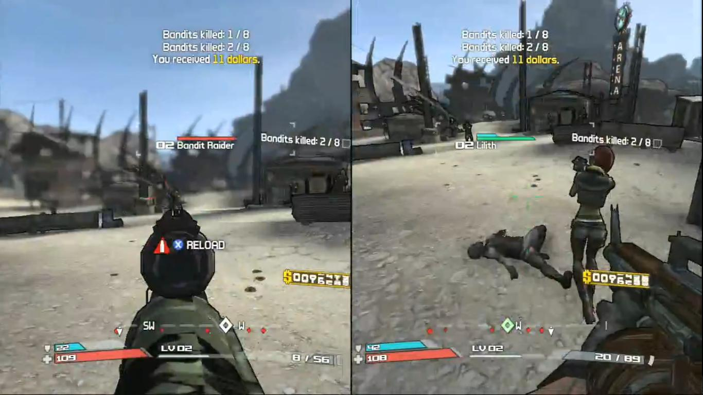
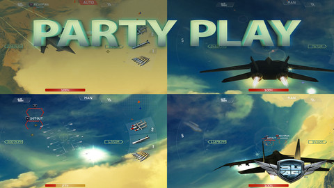
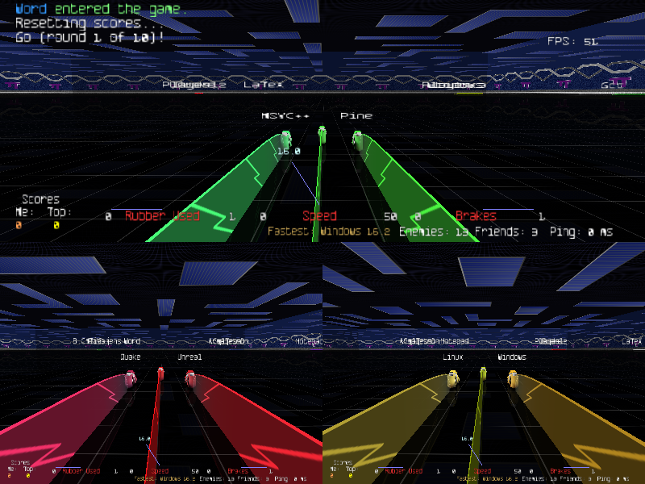

#Games Programming - Lecture 07

###Overview of Today

- Multiplayer Games
- Networked Multiplayer Games

# Multiplayer Games

###Types of Multiplayer Games

- ...
- ...
- ...

###Dimensions to consider with Multiplayer Games

- ...
- ...
- ...

###Dimensions to consider with Multiplayer Games 2

- Number of players
- Locations of players
- Resources of players
- Central processing/storage?
- Trust

###Dimensions to consider with Multiplayer Games 3

- Third party support
  - Libraries
  - PAAS, SAAS
  - Engines
- Real-time
  - What does/can that mean?

###Dimensions to consider with Multiplayer Games 4

- Turn-based vs. continuous
- Match-based vs. continous world
- Single World vs. multiple
- ...

###Multiplayer !=> Networked 1

###Multiplayer !=> Networked 2

###Multiplayer !=> Networked 3

###Multiplayer !=> Networked 4

###Multiplayer !=> Networked 5

#Multiplayer Networked Games

###The Challenge

- incorporating ever more elaborate gaming scenarios into virtual worlds while ensuring player numbers can be measured in the millions
- reaches across a number of research areas in Computer Science
  - is a research area in it's own right
  - for a recent starter see: Consistency Maintenance In Networked Games, by Cheryl Savery
    - https://qspace.library.queensu.ca/bitstream/1974/12475/1/Savery_Cheryl_201409_PHD.pdf

###Multiplayer Networked Games

- Key objective is to **share** some or all of the games state **consistently**
- Unless you are on a single machine:
  - Sharing 100% of state with no delay is not possible
- i.e. in Networked situations:
  - there are **always** bandwidth limitations
  - there is **always** some latency
- other challenges include:
  - lack of a global clock
  - independent failure of components

###Conflict

- Most of the work in the research field is trying to manage these limitations
  - to achieve appropriate properties
  - consistency, reliability, ordering
- The properties we want (or can accept) depend on our Game Concept
  - and other things

###Consistency Models

- **Consistency models define rules for the apparent order and visibility of updates, and it is a continuum with tradeoffs**
- A Consistency Model is a way a system supports a given model if operations on memory follow specific rules
  - specifies a contract between programmer and system
  - the system guarantees that memory will be consistent and the results of memory operations will be predictable
    - if the programmer follows the rules
  - http://en.wikipedia.org/wiki/Consistency_model
- This comes from the field of Distributed Computing, but these also occur outside of networked systems

###CAP theorem

- It is impossible for a distributed computer system to simultaneously provide all three of the following guarantees:
  1. Consistency (all nodes see the same data at the same time)
  2. Availability (a guarantee that every request receives a response about whether it succeeded or failed)
  3. Partition tolerance (the system continues to operate despite arbitrary message loss or failure of part of the system)

- first published as *CAP principle* by Eric Brewer in 1998
- now a theorem - (probably) proven by Seth Gilbert and Nancy Lynch of MIT in 2002
- also known as Brewer's theorem
- http://en.wikipedia.org/wiki/CAP_theorem

###Contrast

- We could also leverage networking for other purposes

  1. ...
  2. ...
  3. ...
  4. ...

###Contrast 2

- We could also leverage networking for other purposes

  1. Score Management, Player Stats, matchmaking etc
  2. Discovery (turns out to be pretty hard)
  3. Distributed Computing (of physics, of graphics of ...)
    - One perspective on all Games Networking is **Distributed Computing**
    - All the key concepts we may discuss occur in that area also

#Fundamental part of the solution (finally!!!)

###Message passing

- we send messages from 1 (or more) parties to 1 (or more) parties
- receiving parties and their supporting infrastructure are responsible for selecting and invoking the actual code to run

###Questions for us wrt Message passing

- who to send messages to
- when to send messages
- what should the messages say
- how to encode the messages - **serialization**
- how to send messages - **message transport**
- how to do this easily/efficiently/scalably!

#Architecture

###Architecture

- Server-Client
- Peer-Peer
- 3-tier, n-tier
- highly coupled (clustered)
- Shared memory
- ...
- Synchronous vs. Asynchronous
- Broker vs. Brokerless?

###Architecture 2

- Req-Res
- PubSub
- Blind-send
- 1-1
- Routing

#Serialization

###Serialization

- translating data structures or object state into a format that can be stored
  - in a file
  - memory buffer
  - transmitted across a network connection link
- used for
  - game state / actions
  - game saves
  - images
  - audio
  - video
  - ...
- need both a **serializer** and a **deserializer**
  - or **encoder** and **decoder** (**codec**)

###Serialization - AKA

- marshalling
- pickling (Python)
- encoding
- hibernation (Java)
- persistence

###Separations of Concerns

- some tools/libraries etc provide both Serialization and Message Transport
  - for me (and probably more) keeping them separate is better
  - so you can mix and match (for debug, for scaling, for the future)
- you may also use **compression**
  - in the serialization format
  - around the serialization format (most common)
- some tools/libaries also require an **interface description language**
  - describes the structure of some data
  - a program that generates source code from that description
    - for generating or parsing a stream of bytes that represents the structured data
  - http://en.wikipedia.org/wiki/Interface_description_language

###Serialization Formats (some)

- standard options
  - Made-up text format, CSV
  - Made-up binary format
  - JSON, BSON
  - XML, Binary XML
  - HTML
  - MsgPack
  - Apache Avro, Apache Thrift (originally Facebook)
  - Protocol Buffers (Google)
  - D-Bus Message Protocol
  - PHP's serialize() & unserialize()
  - YAML
- http://en.wikipedia.org/wiki/Comparison_of_data_serialization_formats

###Serialization Formats (Game Specific)

- standard options
  - Made-up text format, CSV
  - Made-up binary format
  - JSON, BSON
  - XML, Binary XML
  - HTML
  - MsgPack
  - Apache Avro, Apache Thrift (originally Facebook)
  - Protocol Buffers (Google)
  - D-Bus Message Protocol
  - PHP's serialize() & unserialize()
  - YAML
- http://en.wikipedia.org/wiki/Comparison_of_data_serialization_formats

#Message transport

###Message transport

- again support by libraries and engines
- fundamental choices are around **latency**, **reliability**, **ordering**, **network punching**

###Latency

- how long does it take for messages to get from A to B
  - network latency, your hardware, your software, ...
  - variance in latency (jitter)

###Reliability

- are messages definitely going to be delivered?
- what happens if they are not, or in what are the impacts of delayed messages

###Ordering

- do messages arrived in the same order they were sent?
- what happens if they are not?

###Network punching

- can we actually send message from A to B
- to we have to do some magic to enable that
  - NAT traversal, STUN, uPnP

###Message transport techniques

- intra-process communication
- inter-process communication
- network communication

###Message transport tools

- your favourite games engine (maybe)
- UDP, TCP (http://gafferongames.com/networking-for-game-programmers/udp-vs-tcp/ - perhaps)
- HTTP(s), WebSockets
- ZeroMQ
- SDL_net
- RabbitMQ
- SAAS
  - PubNub - https://www.pubnub.com/
  - Pusher
  - Amazon SNS
  - Firebase
  - ...

#Resources (some)

- there are many many, come talk to me
- http://gafferongames.com/networked-physics/introduction-to-networked-physics/
- http://brm.io/game-physics-for-beginners/